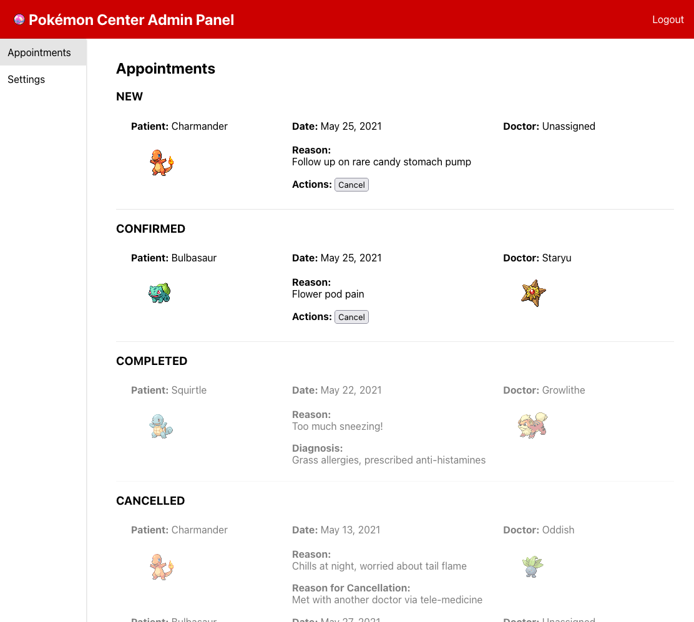
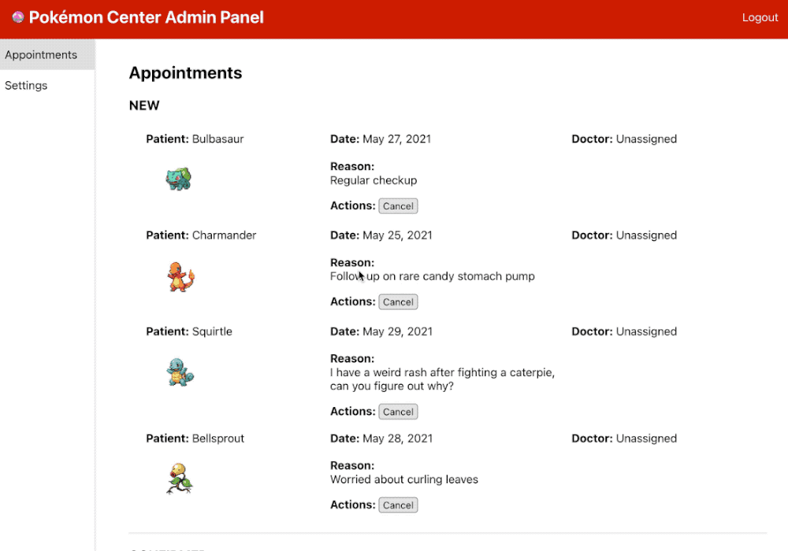

# Schedule Challenge

## Introduction

The local Pokémon Center is in need of some scheduling assistance! Can you use Typescript and React to work with an API to build a scheduling app?

## Getting Started

Before starting, be sure to read and understand all code style patterns, clean code expectations, and git message guidelines that be used to evaluate your submission: [Coding Guidelines](https://docs.google.com/document/d/1P1QtuBEogx1dqxqiTuRlVbngQqspkFESaNZQTJoF-_I/edit#heading=h.d6cjqf5vcg6o) 

### Setup

1. Run `npm install`
2. Run `npm start`

### Notes

- The admin panel will be available at http://localhost:3000
- Once everything is up and running, you can start adding your code in **src/App.tsx**.
- The page will auto-reload any time you save changes to your files
- Patient and doctor photos are stored in the **public/** folder at the root of the repo. URLs to these files start with `/` (e.g. `/bulbasaur.png`, etc...)

## Requirements

### 1. Display appointments by status

The appointments DB table stores all appointments with a `status` column that tracks the state of the appointment. Display all appointments by their status in the following order:

1. New
2. Confirmed
3. Completed
4. Cancelled

Appointments should show patient's and doctor's photos (when assigned), as well as the reason for the appointment request and any additional notes entered by doctors or staff when present:



### 2. Cancel appointments

Pokémon Center staff should be able to cancel appointments that are not already completed or cancelled. A cancelled appointment should update its position in the UI accordingly:



### 3. (Stretch Goal) Confirm appointments

Management also wants staff to be able to confirm appointments. Doctors should be assigned to confirmed appointments so that patients can know who they're seeing ahead of time.

Management's leaving the look up to you...


## Data API

The API powering the admin panel is available at `/api-v1/`. [Use the `fetch()` API](https://developer.mozilla.org/en-US/docs/Web/API/Fetch_API/Using_Fetch) to access the API routes.

### Making requests

By default `fetch()` makes GET requests. To make POST and DELETE requests, set the `method` accordingly in the options object you pass to the function:

```js
// POST
const resp = await (`route/${id}`, {
  method: 'POST',
  body: JSON.stringify(argsObject),
});

// DELETE
const resp = await (`route/${id}`, {
  method: 'DELETE',
});
```

### Routes

#### `GET /api-v1/appointments`

> **Returns:**
> - An `array` of all `appointment` rows in the database.

#### `POST /api-v1/appointments/:id/confirm`

> **Arguments:**
> - `doctorID` (string) The doctor assigned to the appointment
>
> **Returns:**
> - The updated `appointment` row with new status and doctor ID

#### `DELETE /api-v1/appointments/:id`

> **Arguments:**
> - `reason` (string) Why the appointment was cancelled
>
> **Returns:**
> - The updated `appointment` row with new status and reason

#### `GET /api-v1/patients`

> **Returns:**
> - An `array` of all `patient` rows in the database.

#### `GET /api-v1/doctors`

> **Returns:**
> - An `array` of all `doctor` rows in the database.
